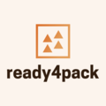

# ready4pack 

## Author R Packages that Extend the Ready4 Framework for Open and Modular Mental Health Systems Models

<!-- badges: start -->
[](https://lifecycle.r-lib.org/articles/stages.html#experimental)
[](https://www.ready4-dev.com/toolkits/)
[](https://doi.org/10.5281/zenodo.5644322)
<!-- badges: end -->

ready4pack provides a set of tools for authoring R packages
of functions, classes, methods and datasets that extend the ready4
framework for open source, modular mental health systems models.  This
development version of the ready4pack package has been made available
as part of the process of testing and documenting the package.
Therefore you should only trial this software if you feel confident
that you understand what it does and have created a sandpit area in
which you can safely undertake testing. If you have any questions,
please contact the authors (matthew.hamilton@orygen.org.au).

To install a development version of this software, run the following commands in your R console:

```r
utils::install.packages("devtools")

devtools::install_github("ready4-dev/ready4pack")

```
